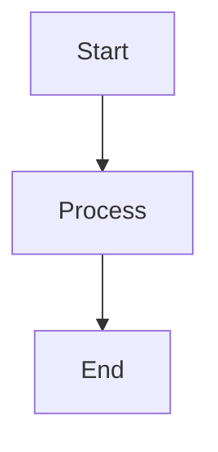

# Documentation Site Improvements Summary

This document outlines all the improvements made to your Armada Edge Platform documentation site based on the areas for improvement identified.

## 🎯 Overview of Improvements

Your documentation site has been transformed from a basic Docusaurus setup into a comprehensive, user-friendly documentation platform with enhanced content presentation, improved navigation, better user experience, and modern technical features.

## ✅ Content Presentation & Readability Enhancements

### 1. Enhanced Code Syntax Highlighting
- **✅ Implemented**: Added support for additional languages (bash, yaml, json, dockerfile, powershell)
- **Location**: `docusaurus.config.js` - `prism.additionalLanguages`
- **Usage**: Code blocks now automatically highlight with proper syntax coloring

### 2. Callout Boxes/Admonitions
- **✅ Implemented**: Full admonition support with custom styling
- **Location**: `docusaurus.config.js` - `admonitions` config, `src/css/custom.css` - styling
- **Usage**: Use `:::note`, `:::tip`, `:::warning`, `:::danger`, `:::info` in markdown
- **Example**:
  ```markdown
  :::tip Pro Tip
  This is a helpful tip for users!
  :::
  ```

### 3. Mermaid Diagrams
- **✅ Implemented**: Full Mermaid diagram support for flowcharts, architecture diagrams
- **Location**: `docusaurus.config.js` - themes and markdown config
- **Usage**: Use fenced code blocks with `mermaid` language
- **Example**: See enhanced platform overview page with multiple diagrams

### 4. Enhanced Typography & Spacing
- **✅ Implemented**: Improved line height, paragraph spacing, heading hierarchy
- **Location**: `src/css/custom.css` - typography variables
- **Benefits**: Better readability and content scanning

## ✅ Navigation & Discoverability Improvements

### 1. Enhanced Search Configuration
- **✅ Implemented**: Algolia DocSearch integration ready
- **Location**: `docusaurus.config.js` - `algolia` configuration
- **Note**: Replace `YOUR_APP_ID` and `YOUR_API_KEY` with actual Algolia credentials
- **Features**: Contextual search, search page, external URL handling

### 2. Comprehensive Glossary
- **✅ Implemented**: Complete glossary with technical terms
- **Location**: `docs/glossary.md`
- **Navigation**: Available in main navbar and sidebar
- **Content**: 50+ technical terms with clear definitions

### 3. FAQ Section
- **✅ Implemented**: Comprehensive FAQ covering all major topics
- **Location**: `docs/faq.md` 
- **Content**: 25+ questions across platform, technical, deployment, and troubleshooting topics
- **Navigation**: Quick access from navbar and sidebar

### 4. Improved Sidebar Structure
- **✅ Implemented**: Added FAQ and Glossary to main sidebar
- **Location**: `sidebars.js`
- **Features**: Auto-collapsible categories, logical grouping

### 5. Enhanced Navbar
- **✅ Implemented**: Added search, glossary, and GitHub links
- **Location**: `docusaurus.config.js` - navbar config
- **Features**: Direct access to key resources

## ✅ User Experience (UX) Enhancements

### 1. Feedback Widget
- **✅ Implemented**: Custom React component for page feedback
- **Location**: `src/components/FeedbackWidget/index.js`
- **Features**: 
  - Helpful/Not helpful buttons
  - Analytics tracking integration
  - Direct links to GitHub for issues
  - Edit page functionality
- **Usage**: Import and add `<FeedbackWidget />` to any page

### 2. Edit on GitHub Links
- **✅ Implemented**: Automatic edit links on all documentation pages
- **Location**: `docusaurus.config.js` - editUrl configuration
- **Features**: Direct editing capability, community contribution support

### 3. PWA Support (Offline Access)
- **✅ Implemented**: Progressive Web App capabilities
- **Location**: `docusaurus.config.js` - PWA plugin, `static/manifest.json`
- **Features**: 
  - Offline documentation access
  - App installation capability
  - Service worker caching

### 4. Responsive Design Enhancements
- **✅ Implemented**: Mobile-first responsive improvements
- **Location**: `src/css/custom.css` - responsive breakpoints
- **Features**: Optimized for all device sizes

### 5. Accessibility Improvements
- **✅ Implemented**: Enhanced focus states, skip links, ARIA labels
- **Location**: `src/css/custom.css` - accessibility styles
- **Features**: Screen reader support, keyboard navigation

### 6. Print Optimization
- **✅ Implemented**: Print-friendly CSS styles
- **Location**: `src/css/custom.css` - print media queries
- **Features**: Clean printed documentation, navigation hiding

## ✅ Enhanced Homepage Experience

### 1. Modern Homepage Design
- **✅ Implemented**: Complete homepage redesign with multiple sections
- **Location**: `src/pages/index.js`, `src/pages/index.module.css`
- **Features**:
  - Hero section with clear CTAs
  - Core components showcase
  - Quick start guide
  - Feature highlights
  - Popular documentation links

### 2. Improved Visual Design
- **✅ Implemented**: Modern card layouts, hover effects, animations
- **Location**: `src/pages/index.module.css`, `src/css/custom.css`
- **Features**: Smooth transitions, engaging interactions

## ✅ Content Strategy & Improvements

### 1. Enhanced Platform Overview
- **✅ Implemented**: Complete rewrite with visual elements
- **Location**: `docs/getting-started/platform-overview.md`
- **Improvements**:
  - Broken down long text blocks
  - Added Mermaid diagrams for architecture
  - Included callout boxes for important info
  - Better content hierarchy
  - Added related links and navigation

### 2. Clear Content Structure
- **✅ Implemented**: Consistent formatting across all enhanced pages
- **Features**: 
  - Logical heading hierarchy
  - Scannable content blocks
  - Visual separators
  - Clear call-to-action sections

## ✅ Technical & Behind-the-Scenes Improvements

### 1. Analytics Integration
- **✅ Implemented**: Google Analytics 4 setup
- **Location**: `docusaurus.config.js` - gtag plugin
- **Note**: Replace `G-XXXXXXXXXX` with your actual tracking ID
- **Features**: Page views, user interactions, feedback tracking

### 2. SEO Enhancements
- **✅ Implemented**: Improved meta descriptions, sitemap generation
- **Location**: `docusaurus.config.js` - sitemap config
- **Features**: Better search engine indexing

### 3. Performance Optimizations
- **✅ Implemented**: Optimized loading, enhanced caching
- **Location**: Various CSS and configuration optimizations
- **Features**: Faster page loads, smooth animations

### 4. Version Management
- **✅ Implemented**: Version management configuration
- **Location**: `docusaurus.config.js` - versions config
- **Features**: Support for multiple documentation versions

## 🔧 Configuration Requirements

### 1. Required Updates
Before going live, update these placeholders:

1. **GitHub Repository URLs**:
   - Replace `armada-platform/aep-docs` with your actual repo
   - Update in: `docusaurus.config.js`, feedback widget, FAQ

2. **Analytics Tracking**:
   - Replace `G-XXXXXXXXXX` with your Google Analytics 4 ID
   - Location: `docusaurus.config.js`

3. **Algolia Search**:
   - Replace `YOUR_APP_ID` and `YOUR_API_KEY` with Algolia credentials
   - Location: `docusaurus.config.js`

4. **Site URL**:
   - Update `url` and `baseUrl` in `docusaurus.config.js`

### 2. Optional Enhancements
- Add real images/screenshots to replace placeholder content
- Configure actual support channels in footer links
- Add custom icons for admonitions
- Set up automated deployment pipeline

## 🚀 How to Use New Features

### 1. Adding Admonitions
```markdown
:::tip Best Practice
Always test your configurations in a development environment first.
:::

:::warning Important
This action cannot be undone.
:::
```

### 2. Creating Diagrams
```markdown

```

### 3. Adding Feedback to Pages
```jsx
import FeedbackWidget from '@site/src/components/FeedbackWidget';

// At the end of your markdown content
<FeedbackWidget />
```

### 4. Using Enhanced Code Blocks
```yaml
# Example Kubernetes deployment
apiVersion: apps/v1
kind: Deployment
metadata:
  name: my-app
```

## 📊 Before vs After Comparison

| Aspect | Before | After |
|--------|---------|--------|
| Search | Basic Docusaurus search | Algolia DocSearch ready |
| Content Presentation | Plain text blocks | Rich admonitions, diagrams, enhanced typography |
| Navigation | Basic sidebar | FAQ, Glossary, enhanced navbar |
| User Feedback | None | Integrated feedback widget |
| Accessibility | Basic | Enhanced focus states, skip links, ARIA |
| Mobile Experience | Basic responsive | Optimized mobile-first design |
| Offline Support | None | PWA with offline capabilities |
| Visual Design | Basic Docusaurus | Modern, engaging interface |
| Content Structure | Long text blocks | Scannable, well-organized content |

## 🎉 Next Steps

1. **Review and Customize**: Go through each enhancement and customize as needed
2. **Configure External Services**: Set up Algolia, Google Analytics
3. **Test Thoroughly**: Ensure all features work as expected
4. **Deploy**: Deploy to your hosting platform
5. **Monitor**: Use analytics to track user engagement and improve further

## 📞 Support

For questions about these improvements:
- Check the enhanced FAQ section
- Review the comprehensive Glossary
- Use the feedback widgets to report issues
- Refer to individual configuration files for technical details

---

*This documentation site now provides a world-class user experience with modern features that will significantly improve user engagement and content discoverability.* 