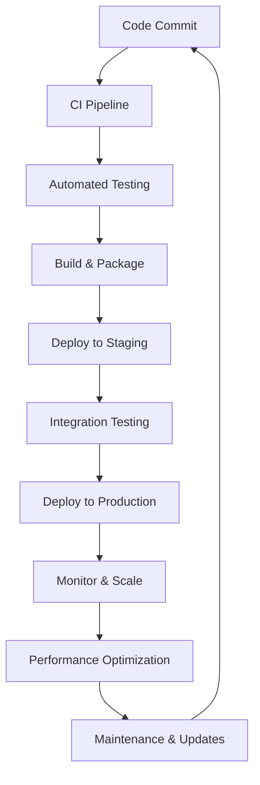

# Application Lifecycle Management (ALM)

Comprehensive guidance for managing the complete application lifecycle on the Edge Platform, from development through deployment, scaling, and maintenance.

## Overview

Application Lifecycle Management encompasses the entire journey of applications from initial development to production deployment and ongoing maintenance. This section provides practical guidance for implementing robust ALM practices on the Edge Platform.

## What You'll Learn

### A. CI/CD Integration
Integration patterns for popular CI/CD tools, automated deployment strategies, and GitOps workflows tailored for edge environments.

### B. Deployment Strategies & Rollbacks
Advanced deployment patterns including blue-green deployments, canary releases, rolling updates, and comprehensive rollback procedures.

### C. Scaling & Performance Optimization
Scaling strategies, performance optimization techniques, and edge-specific considerations for maintaining optimal application performance.

## Key Concepts

### Continuous Integration & Deployment

#### Automated Testing
Comprehensive testing strategies for edge applications

#### Pipeline Orchestration
Managing complex deployment pipelines

#### Environment Promotion
Safe progression through development, staging, and production

### Deployment Excellence

#### Zero-Downtime Deployments
Maintaining service availability during updates

#### Progressive Delivery
Gradual rollout strategies with automated validation

#### Rollback Strategies
Quick recovery from deployment issues

### Scaling & Performance

#### Auto-scaling
Automatic resource adjustment based on demand

#### Performance Monitoring
Continuous performance assessment and optimization

#### Resource Optimization
Efficient resource utilization at the edge

## ALM Workflow

## Prerequisites

### Foundation Knowledge
- Understanding of [Platform Architecture](../platform-deep-dive/overview).
- Familiarity with container orchestration.
- Basic knowledge of CI/CD concepts.

### Technical Skills
- Experience with version control systems.
- Understanding of containerization concepts.
- Knowledge of Kubernetes fundamentals.

## Getting Started

Begin with CI/CD Integration to establish your development pipeline. Then, explore deployment strategies and scaling approaches based on your application requirements. Each section provides both strategic guidance and hands-on implementation examples to support your ALM journey.

Each section provides both strategic guidance and hands-on implementation examples. 