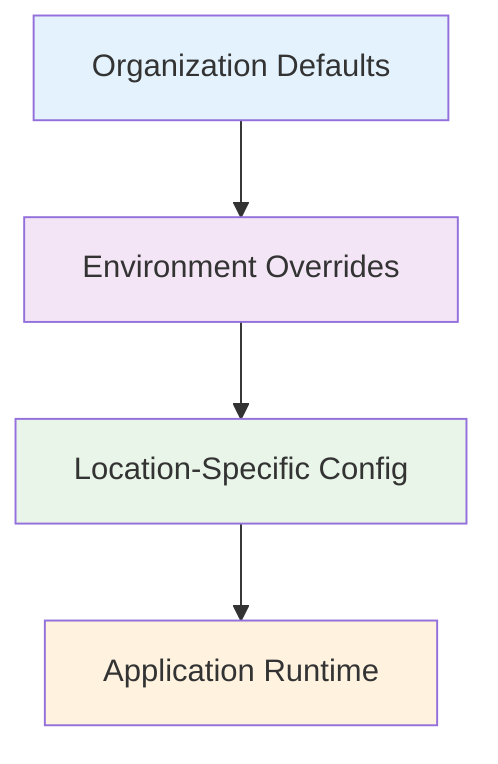

# Configuration Management for AEP

Learn advanced strategies for managing application configuration, secrets, and environment variables on the Armada Edge Platform.

## Overview

Effective configuration management is crucial for edge deployments where applications may run in various environments with different requirements. This guide covers best practices for externalizing and managing configuration in AEP.

## Configuration Strategies

### Configuration Hierarchy



### The 12-Factor App Configuration

:::tip Configuration Principles
Follow the 12-Factor App methodology:
- Store config in environment variables
- Strict separation between code and config
- No config constants in code
- Config varies substantially across deployments
:::

## ConfigMaps

### Basic ConfigMap

```yaml
apiVersion: v1
kind: ConfigMap
metadata:
  name: app-config
  namespace: production
data:
  # Simple key-value pairs
  database_host: "postgres.example.com"
  database_port: "5432"
  log_level: "info"
  max_connections: "100"
  
  # Multi-line configuration files
  nginx.conf: |
    upstream backend {
        server app1:3000;
        server app2:3000;
    }
    
    server {
        listen 80;
        location / {
            proxy_pass http://backend;
        }
    }
  
  # JSON configuration
  app-settings.json: |
    {
      "features": {
        "caching": true,
        "monitoring": true,
        "debug": false
      },
      "limits": {
        "requestTimeout": 30000,
        "maxPayloadSize": 1048576
      }
    }
```

### Environment-Specific ConfigMaps

```yaml
# Base configuration
apiVersion: v1
kind: ConfigMap
metadata:
  name: app-config-base
data:
  database_port: "5432"
  redis_port: "6379"
  log_format: "json"
  
---
# Environment overlay
apiVersion: v1
kind: ConfigMap
metadata:
  name: app-config-staging
data:
  database_host: "staging-db.example.com"
  log_level: "debug"
  feature_flags: "experimental_features=true"
  
---
# Production configuration
apiVersion: v1
kind: ConfigMap
metadata:
  name: app-config-production
data:
  database_host: "prod-db.example.com"
  log_level: "warn"
  cache_ttl: "3600"
```

### Using ConfigMaps in Deployments

```yaml
apiVersion: apps/v1
kind: Deployment
metadata:
  name: myapp
spec:
  template:
    spec:
      containers:
      - name: myapp
        image: myapp:latest
        # Environment variables from ConfigMap
        envFrom:
        - configMapRef:
            name: app-config
        env:
        # Individual values
        - name: DATABASE_URL
          valueFrom:
            configMapKeyRef:
              name: app-config
              key: database_host
        # Volume mounts for file-based config
        volumeMounts:
        - name: config-volume
          mountPath: /etc/config
          readOnly: true
      volumes:
      - name: config-volume
        configMap:
          name: app-config
```

## Secrets Management

### Basic Secret

```yaml
apiVersion: v1
kind: Secret
metadata:
  name: app-secrets
  namespace: production
type: Opaque
data:
  # Base64 encoded values
  database-password: cGFzc3dvcmQxMjM=
  api-key: YWJjZGVmZ2hpams=
  jwt-secret: bXlzdXBlcnNlY3JldGp3dA==
```

### Creating Secrets from Command Line

```bash
# Create secret from literal values
kubectl create secret generic app-secrets \
  --from-literal=database-password=mypassword \
  --from-literal=api-key=myapikey

# Create secret from files
kubectl create secret generic app-secrets \
  --from-file=database-password=./db-password.txt \
  --from-file=api-key=./api-key.txt

# Create TLS secret
kubectl create secret tls app-tls-secret \
  --cert=path/to/cert.crt \
  --key=path/to/cert.key
```

### External Secrets Integration

```yaml
# Using External Secrets Operator
apiVersion: external-secrets.io/v1beta1
kind: SecretStore
metadata:
  name: vault-backend
spec:
  provider:
    vault:
      server: "https://vault.example.com"
      path: "secret"
      version: "v2"
      auth:
        kubernetes:
          mountPath: "kubernetes"
          role: "myapp-role"

---
apiVersion: external-secrets.io/v1beta1
kind: ExternalSecret
metadata:
  name: vault-secret
spec:
  refreshInterval: 30s
  secretStoreRef:
    name: vault-backend
    kind: SecretStore
  target:
    name: myapp-secrets
    creationPolicy: Owner
  data:
  - secretKey: database-password
    remoteRef:
      key: myapp/config
      property: db_password
  - secretKey: api-key
    remoteRef:
      key: myapp/config
      property: api_key
```

## Environment Variables

### Environment Variable Sources

```yaml
spec:
  containers:
  - name: myapp
    env:
    # Static value
    - name: APP_ENV
      value: "production"
    
    # From ConfigMap
    - name: LOG_LEVEL
      valueFrom:
        configMapKeyRef:
          name: app-config
          key: log_level
    
    # From Secret
    - name: DB_PASSWORD
      valueFrom:
        secretKeyRef:
          name: app-secrets
          key: database-password
    
    # From field reference
    - name: NODE_NAME
      valueFrom:
        fieldRef:
          fieldPath: spec.nodeName
    
    # From resource reference
    - name: CPU_LIMIT
      valueFrom:
        resourceFieldRef:
          resource: limits.cpu
```

### Edge-Specific Environment Variables

```yaml
env:
# Edge location detection
- name: EDGE_LOCATION
  valueFrom:
    fieldRef:
      fieldPath: spec.nodeName

# Edge-specific configuration
- name: DEPLOYMENT_MODE
  value: "edge"

- name: CACHE_STRATEGY
  value: "local-first"

- name: BANDWIDTH_MODE
  value: "limited"

# Conditional environment variables
- name: DEBUG_MODE
  value: "{{ if eq .Values.environment \"development\" }}true{{ else }}false{{ end }}"
```

## Configuration Hot-Reloading

### File Watcher Pattern

```javascript
// Node.js example
const fs = require('fs');
const path = require('path');

class ConfigManager {
  constructor(configPath) {
    this.configPath = configPath;
    this.config = this.loadConfig();
    this.watchConfig();
  }

  loadConfig() {
    try {
      const configData = fs.readFileSync(this.configPath, 'utf8');
      return JSON.parse(configData);
    } catch (error) {
      console.error('Failed to load config:', error);
      return {};
    }
  }

  watchConfig() {
    fs.watch(this.configPath, (eventType) => {
      if (eventType === 'change') {
        console.log('Config file changed, reloading...');
        this.config = this.loadConfig();
        this.onConfigChange(this.config);
      }
    });
  }

  onConfigChange(newConfig) {
    // Override this method to handle config changes
    console.log('Configuration updated:', newConfig);
  }
}
```

### Signal-Based Reloading

```yaml
# Deployment with config hash annotation
apiVersion: apps/v1
kind: Deployment
metadata:
  name: myapp
spec:
  template:
    metadata:
      annotations:
        config-hash: {{ include (print $.Template.BasePath "/configmap.yaml") . | sha256sum }}
    spec:
      containers:
      - name: myapp
        image: myapp:latest
        # Signal handling for graceful reload
        lifecycle:
          preStop:
            exec:
              command: ["/bin/sh", "-c", "kill -USR1 1"]
```

## Advanced Configuration Patterns

### Configuration Validation

```yaml
apiVersion: v1
kind: ConfigMap
metadata:
  name: app-config
  annotations:
    config.kubernetes.io/validation: |
      type: object
      properties:
        database_host:
          type: string
          pattern: "^[a-zA-Z0-9.-]+$"
        database_port:
          type: integer
          minimum: 1
          maximum: 65535
        log_level:
          type: string
          enum: ["debug", "info", "warn", "error"]
      required: ["database_host", "database_port"]
data:
  database_host: "postgres.example.com"
  database_port: "5432"
  log_level: "info"
```

### Feature Flags

```yaml
apiVersion: v1
kind: ConfigMap
metadata:
  name: feature-flags
data:
  features.yaml: |
    features:
      new_ui:
        enabled: true
        rollout_percentage: 50
        environments: ["staging", "production"]
      
      experimental_api:
        enabled: false
        beta_users: ["user1", "user2"]
        
      edge_caching:
        enabled: true
        regions: ["us-west", "us-east"]
        cache_ttl: 3600
```

### Multi-Environment Configuration

```yaml
# Kustomization for environment-specific configs
# base/kustomization.yaml
apiVersion: kustomize.config.k8s.io/v1beta1
kind: Kustomization

resources:
- deployment.yaml
- configmap.yaml

# overlays/staging/kustomization.yaml
apiVersion: kustomize.config.k8s.io/v1beta1
kind: Kustomization

bases:
- ../../base

patchesStrategicMerge:
- configmap-patch.yaml

configMapGenerator:
- name: app-config
  literals:
  - environment=staging
  - debug=true
```

## Configuration Monitoring

### Configuration Drift Detection

```bash
#!/bin/bash
# Script to detect configuration drift

# Expected configuration checksum
EXPECTED_CHECKSUM="abc123def456"

# Current configuration checksum
CURRENT_CHECKSUM=$(kubectl get configmap app-config -o yaml | sha256sum)

if [ "$EXPECTED_CHECKSUM" != "$CURRENT_CHECKSUM" ]; then
  echo "Configuration drift detected!"
  echo "Expected: $EXPECTED_CHECKSUM"
  echo "Current: $CURRENT_CHECKSUM"
  exit 1
fi
```

### Configuration Audit Logging

```yaml
apiVersion: v1
kind: ConfigMap
metadata:
  name: audit-config
  annotations:
    audit.kubernetes.io/enabled: "true"
data:
  audit-policy.yaml: |
    apiVersion: audit.k8s.io/v1
    kind: Policy
    rules:
    - level: Metadata
      resources:
      - group: ""
        resources: ["configmaps", "secrets"]
      namespaces: ["production"]
```

## Testing Configuration

### Configuration Testing

```bash
#!/bin/bash
# Configuration validation script

# Test ConfigMap exists
kubectl get configmap app-config -n production || exit 1

# Test required keys exist
REQUIRED_KEYS=("database_host" "database_port" "log_level")
for key in "${REQUIRED_KEYS[@]}"; do
  kubectl get configmap app-config -o jsonpath="{.data.$key}" | grep -q . || {
    echo "Missing required key: $key"
    exit 1
  }
done

echo "Configuration validation passed"
```

### Integration Testing

```yaml
# Test pod for configuration validation
apiVersion: v1
kind: Pod
metadata:
  name: config-test
spec:
  restartPolicy: Never
  containers:
  - name: test
    image: busybox
    command:
    - /bin/sh
    - -c
    - |
      echo "Testing configuration..."
      test -n "$DATABASE_HOST" || exit 1
      test -n "$DATABASE_PORT" || exit 1
      echo "Configuration test passed"
    envFrom:
    - configMapRef:
        name: app-config
```

## Configuration Best Practices

### Security

- ✅ Never store secrets in ConfigMaps
- ✅ Use Secret objects for sensitive data
- ✅ Implement proper RBAC for config access
- ✅ Encrypt etcd data at rest
- ✅ Use external secret management systems

### Maintainability

- ✅ Version your configuration
- ✅ Document configuration options
- ✅ Use descriptive key names
- ✅ Implement configuration validation
- ✅ Monitor configuration changes

### Edge Optimization

- ✅ Minimize configuration size
- ✅ Use local caching strategies
- ✅ Implement graceful degradation
- ✅ Consider offline scenarios

## Next Steps

- [Resource Requirements](./resource-requirements.md) - Optimize resource allocation
- [Security Considerations](./security-considerations.md) - Implement security best practices
- [Helm Charts](./helm-charts.md) - Package with configuration templating

---

:::info Configuration Tools
Consider using configuration management tools like:
- **Kustomize** - For environment-specific overlays
- **Helm** - For templated configuration
- **External Secrets Operator** - For external secret management
- **ArgoCD** - For GitOps-based configuration deployment
::: 