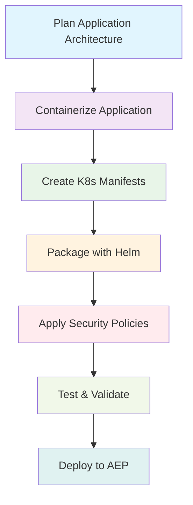

# Packing your application for AEP Deployment

Welcome to the comprehensive guide for packaging your applications for deployment on the Armada Edge Platform (AEP). This section will walk you through all the essential steps, best practices, and considerations for preparing your applications for successful deployment on our edge infrastructure.

## What You'll Learn

This section covers everything you need to know about application packaging for AEP:

- **Container Best Practices** - Optimizing Docker images for edge deployment
- **Kubernetes Manifests** - Creating and managing deployment configurations
- **Helm Charts** - Packaging applications for easy installation and management
- **Configuration Management** - Handling secrets, config maps, and environment variables
- **Resource Requirements** - Defining CPU, memory, and storage needs
- **Security Considerations** - Implementing security best practices in your packaging

## Prerequisites

Before diving into application packaging, ensure you have:

- ✅ Basic understanding of containerization concepts
- ✅ Familiarity with Kubernetes fundamentals
- ✅ Access to the Armada Edge Platform
- ✅ Docker installed for local development
- ✅ kubectl configured for your target environment

## Packaging Workflow

## Key Benefits of Proper Packaging

:::tip Why Packaging Matters
Well-packaged applications on AEP provide:
- **Faster Deployment** - Optimized images deploy quickly across edge locations
- **Better Resource Utilization** - Proper sizing ensures efficient resource usage
- **Enhanced Security** - Built-in security practices protect your applications
- **Simplified Management** - Helm charts make updates and rollbacks easy
- **Edge Optimization** - Specialized configurations for edge environments
:::

## Application Packaging Patterns

### Microservices Pattern
For applications following microservices architecture:
- Package each service as a separate container
- Use shared configuration through ConfigMaps
- Implement service discovery patterns
- Consider inter-service communication security

### Monolithic Pattern
For monolithic applications:
- Single container with all components
- Careful resource allocation
- Consideration for scaling limitations
- Migration path planning

### Hybrid Pattern
For applications with mixed architectures:
- Separate critical components
- Shared data layers
- Gradual decomposition strategy

## Packaging Checklist

Before deploying to AEP, verify:

- [ ] **Image Optimization** - Minimal base images, multi-stage builds
- [ ] **Security Scanning** - No critical vulnerabilities
- [ ] **Resource Limits** - CPU and memory limits defined
- [ ] **Health Checks** - Liveness and readiness probes configured
- [ ] **Configuration** - Externalized configuration management
- [ ] **Secrets Management** - Sensitive data properly handled
- [ ] **Documentation** - Clear deployment and operational guides

## Quick Start

Ready to get started? Follow this recommended path:

1. **[Container Best Practices](./container-best-practices.md)** - Start with optimizing your Docker images
2. **[Kubernetes Manifests](./kubernetes-manifests.md)** - Learn to create effective K8s configurations
3. **[Helm Charts](./helm-charts.md)** - Package your application for easy deployment
4. **[Security Considerations](./security-considerations.md)** - Implement security best practices

## Additional Resources

- [AEP Platform Overview](../getting-started/platform-overview.md)
- [Application Lifecycle Management](../application-lifecycle/overview.md)
- [Platform Deep Dive](../platform-deep-dive/overview.md)

---

:::info Need Help?
If you have questions about application packaging or need assistance with your specific use case, check out our [Support Channels](../developer-resources/support/support-channels.md) or visit the [FAQ](../faq.md).
::: 