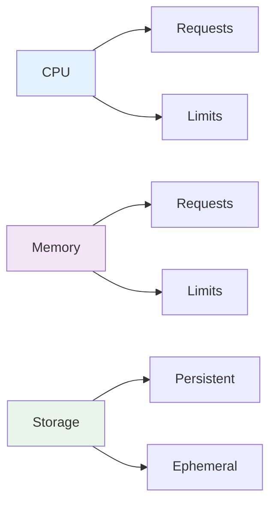

# Resource Requirements for AEP

Learn how to define, optimize, and manage resource requirements for applications deployed on the Armada Edge Platform.

## Overview

Proper resource allocation is critical for edge deployments where compute resources may be limited. This guide covers best practices for defining CPU, memory, and storage requirements that ensure efficient operation in edge environments.

## Understanding Resource Types

### Compute Resources



### Resource Units

```yaml
# CPU units
# 1 CPU = 1000m (millicpu)
cpu: "500m"    # 0.5 CPU
cpu: "1"       # 1 CPU
cpu: "2.5"     # 2.5 CPUs

# Memory units
memory: "128Mi"   # 128 Mebibytes
memory: "1Gi"     # 1 Gibibyte
memory: "512M"    # 512 Megabytes

# Storage units
storage: "10Gi"   # 10 Gibibytes
storage: "100M"   # 100 Megabytes
```

## Resource Requests and Limits

### Basic Resource Configuration

```yaml
apiVersion: apps/v1
kind: Deployment
metadata:
  name: resource-demo
spec:
  template:
    spec:
      containers:
      - name: app
        image: myapp:latest
        resources:
          # Resource requests (guaranteed)
          requests:
            memory: "128Mi"
            cpu: "100m"
          # Resource limits (maximum)
          limits:
            memory: "256Mi"
            cpu: "200m"
```

### Edge-Optimized Resource Allocation

```yaml
# Small footprint edge application
apiVersion: apps/v1
kind: Deployment
metadata:
  name: edge-app
spec:
  template:
    spec:
      containers:
      - name: edge-app
        image: edge-app:latest
        resources:
          requests:
            memory: "64Mi"     # Minimal memory footprint
            cpu: "50m"         # Low CPU baseline
          limits:
            memory: "128Mi"    # Conservative limit for edge
            cpu: "100m"        # Burst capacity
        # Memory-efficient environment variables
        env:
        - name: NODE_OPTIONS
          value: "--max-old-space-size=96"  # Limit heap size
```

### Multi-Container Resource Planning

```yaml
apiVersion: apps/v1
kind: Deployment
metadata:
  name: multi-container-app
spec:
  template:
    spec:
      containers:
      # Main application container
      - name: app
        image: myapp:latest
        resources:
          requests:
            memory: "256Mi"
            cpu: "200m"
          limits:
            memory: "512Mi"
            cpu: "500m"
      
      # Sidecar logging container
      - name: log-shipper
        image: fluent-bit:latest
        resources:
          requests:
            memory: "32Mi"
            cpu: "10m"
          limits:
            memory: "64Mi"
            cpu: "50m"
      
      # Monitoring sidecar
      - name: metrics-exporter
        image: prometheus-exporter:latest
        resources:
          requests:
            memory: "16Mi"
            cpu: "5m"
          limits:
            memory: "32Mi"
            cpu: "25m"
```

## Quality of Service Classes

### Guaranteed QoS

```yaml
# Guaranteed QoS - requests == limits
resources:
  requests:
    memory: "256Mi"
    cpu: "200m"
  limits:
    memory: "256Mi"
    cpu: "200m"
```

### Burstable QoS

```yaml
# Burstable QoS - requests < limits
resources:
  requests:
    memory: "128Mi"
    cpu: "100m"
  limits:
    memory: "256Mi"
    cpu: "200m"
```

### Best Effort QoS

```yaml
# Best Effort QoS - no requests or limits
# Not recommended for production edge deployments
resources: {}
```

## Horizontal Pod Autoscaling

### CPU-Based Autoscaling

```yaml
apiVersion: autoscaling/v2
kind: HorizontalPodAutoscaler
metadata:
  name: app-hpa
spec:
  scaleTargetRef:
    apiVersion: apps/v1
    kind: Deployment
    name: myapp
  minReplicas: 2
  maxReplicas: 10
  metrics:
  - type: Resource
    resource:
      name: cpu
      target:
        type: Utilization
        averageUtilization: 70
```

### Memory-Based Autoscaling

```yaml
apiVersion: autoscaling/v2
kind: HorizontalPodAutoscaler
metadata:
  name: memory-hpa
spec:
  scaleTargetRef:
    apiVersion: apps/v1
    kind: Deployment
    name: memory-intensive-app
  minReplicas: 1
  maxReplicas: 5
  metrics:
  - type: Resource
    resource:
      name: memory
      target:
        type: Utilization
        averageUtilization: 80
```

### Custom Metrics Autoscaling

```yaml
apiVersion: autoscaling/v2
kind: HorizontalPodAutoscaler
metadata:
  name: custom-hpa
spec:
  scaleTargetRef:
    apiVersion: apps/v1
    kind: Deployment
    name: api-app
  minReplicas: 2
  maxReplicas: 20
  metrics:
  - type: Pods
    pods:
      metric:
        name: requests_per_second
      target:
        type: AverageValue
        averageValue: "100"
  - type: Resource
    resource:
      name: cpu
      target:
        type: Utilization
        averageUtilization: 60
```

## Vertical Pod Autoscaling

### VPA Configuration

```yaml
apiVersion: autoscaling.k8s.io/v1
kind: VerticalPodAutoscaler
metadata:
  name: app-vpa
spec:
  targetRef:
    apiVersion: apps/v1
    kind: Deployment
    name: myapp
  updatePolicy:
    updateMode: "Auto"  # "Off", "Initial", "Auto"
  resourcePolicy:
    containerPolicies:
    - containerName: app
      maxAllowed:
        cpu: "1"
        memory: "1Gi"
      minAllowed:
        cpu: "50m"
        memory: "64Mi"
      controlledResources: ["cpu", "memory"]
```

## Storage Resources

### Persistent Volume Claims

```yaml
apiVersion: v1
kind: PersistentVolumeClaim
metadata:
  name: app-storage
spec:
  accessModes:
    - ReadWriteOnce
  resources:
    requests:
      storage: 10Gi
  storageClassName: fast-ssd
```

### Storage in Deployments

```yaml
apiVersion: apps/v1
kind: Deployment
metadata:
  name: stateful-app
spec:
  template:
    spec:
      containers:
      - name: app
        image: myapp:latest
        resources:
          requests:
            memory: "256Mi"
            cpu: "200m"
            # Ephemeral storage request
            ephemeral-storage: "1Gi"
          limits:
            memory: "512Mi"
            cpu: "500m"
            ephemeral-storage: "2Gi"
        volumeMounts:
        - name: app-data
          mountPath: /data
        - name: tmp-storage
          mountPath: /tmp
      volumes:
      - name: app-data
        persistentVolumeClaim:
          claimName: app-storage
      - name: tmp-storage
        emptyDir:
          sizeLimit: 1Gi
```

## Resource Optimization Strategies

### Right-Sizing Applications

```bash
#!/bin/bash
# Resource analysis script

# Get current resource usage
kubectl top pods -n production

# Get resource requests vs usage
kubectl get pods -n production -o custom-columns=\
"NAME:.metadata.name,\
CPU_REQUEST:.spec.containers[0].resources.requests.cpu,\
MEMORY_REQUEST:.spec.containers[0].resources.requests.memory"

# Analyze over time
kubectl top pods -n production --containers --use-protocol-buffers
```

### Resource Monitoring

```yaml
apiVersion: v1
kind: ServiceMonitor
metadata:
  name: resource-monitoring
spec:
  selector:
    matchLabels:
      app: myapp
  endpoints:
  - port: metrics
    interval: 30s
    path: /metrics
```

### Performance Profiling

```yaml
# Development pod with profiling tools
apiVersion: v1
kind: Pod
metadata:
  name: profiling-pod
spec:
  containers:
  - name: profiler
    image: myapp:debug
    resources:
      requests:
        memory: "512Mi"
        cpu: "100m"
      limits:
        memory: "1Gi"
        cpu: "500m"
    env:
    - name: ENABLE_PROFILING
      value: "true"
    ports:
    - containerPort: 6060  # pprof port
      name: profiling
```

## Edge-Specific Considerations

### Resource Constraints

```yaml
# Edge node with limited resources
apiVersion: apps/v1
kind: Deployment
metadata:
  name: constrained-edge-app
spec:
  template:
    spec:
      # Node selection for edge
      nodeSelector:
        node-type: edge
        resource-tier: limited
      
      # Tolerate resource constraints
      tolerations:
      - key: "resource-constrained"
        operator: "Equal"
        value: "true"
        effect: "NoSchedule"
      
      containers:
      - name: app
        image: minimal-app:latest
        resources:
          requests:
            memory: "32Mi"    # Very minimal
            cpu: "25m"        # Low baseline
          limits:
            memory: "64Mi"    # Conservative limit
            cpu: "50m"        # Minimal burst
```

### Resource Efficiency Patterns

```yaml
# Resource-aware configuration
apiVersion: v1
kind: ConfigMap
metadata:
  name: resource-config
data:
  # Memory-efficient settings
  jvm-options: "-Xms32m -Xmx64m -XX:+UseG1GC"
  
  # CPU-efficient settings
  worker-threads: "2"
  connection-pool-size: "5"
  
  # I/O efficient settings
  buffer-size: "4096"
  batch-size: "100"
```

## Resource Planning Checklist

### Pre-Deployment Assessment

- [ ] **Load Testing** - Performed under realistic conditions
- [ ] **Memory Profiling** - Identified memory patterns and leaks
- [ ] **CPU Profiling** - Analyzed CPU usage patterns
- [ ] **Storage Analysis** - Estimated persistent and ephemeral needs
- [ ] **Scaling Requirements** - Defined min/max replica needs
- [ ] **Edge Constraints** - Considered edge node limitations

### Resource Configuration

- [ ] **Requests Set** - Appropriate resource requests defined
- [ ] **Limits Set** - Conservative but functional limits
- [ ] **QoS Class** - Appropriate QoS class selected
- [ ] **Autoscaling** - HPA/VPA configured if needed
- [ ] **Monitoring** - Resource metrics collection enabled

### Edge Optimization

- [ ] **Minimal Footprint** - Optimized for edge constraints
- [ ] **Graceful Degradation** - Handles resource pressure
- [ ] **Local Storage** - Efficient use of local storage
- [ ] **Network Efficiency** - Minimized network resource usage

## Resource Testing

### Load Testing

```yaml
# Load testing job
apiVersion: batch/v1
kind: Job
metadata:
  name: load-test
spec:
  template:
    spec:
      containers:
      - name: load-test
        image: artillery:latest
        resources:
          requests:
            memory: "256Mi"
            cpu: "200m"
          limits:
            memory: "512Mi"
            cpu: "500m"
        command:
        - /bin/sh
        - -c
        - |
          artillery quick --count 100 --num 10 http://myapp-service/api/health
      restartPolicy: Never
```

### Resource Stress Testing

```bash
#!/bin/bash
# Stress testing script

# Memory stress test
kubectl run memory-stress --image=polinux/stress \
  --requests='memory=100Mi' \
  --limits='memory=200Mi' \
  -- stress --vm 1 --vm-bytes 150M --timeout 60s

# CPU stress test  
kubectl run cpu-stress --image=polinux/stress \
  --requests='cpu=100m' \
  --limits='cpu=200m' \
  -- stress --cpu 2 --timeout 60s
```

## Next Steps

- [Security Considerations](./security-considerations.md) - Implement security best practices
- [Application Lifecycle Management](../application-lifecycle/overview.md) - Manage deployed resources
- [Platform Deep Dive](../platform-deep-dive/overview.md) - Understand platform capabilities

---

:::tip Resource Optimization
Continuously monitor and adjust resource allocations based on actual usage patterns. Edge environments benefit greatly from right-sized applications that make efficient use of limited resources.
::: 