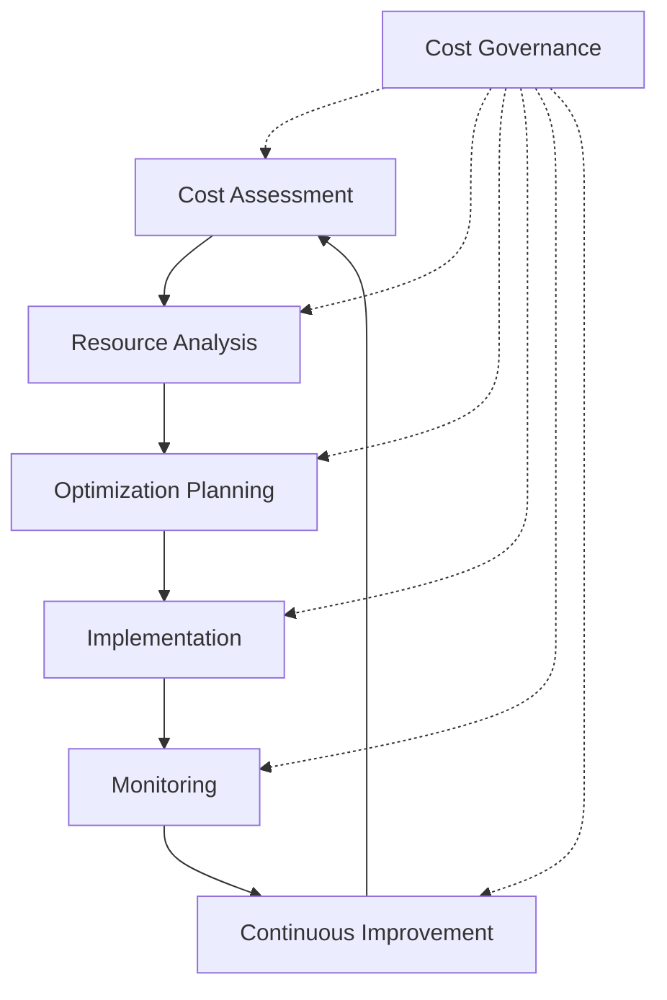

# Cost Management

Strategic guidance for optimizing costs and managing financial aspects of Edge Platform deployments.

## Overview

Cost management is crucial for sustainable edge computing operations. This section provides comprehensive guidance for understanding pricing models, implementing cost optimization strategies, and maintaining financial efficiency.

## What You'll Learn

### Pricing Model
Understand the platform pricing structure, billing components, and cost factors specific to edge deployments.

### Cost Optimization Strategies
Proven strategies for reducing operational costs while maintaining performance and reliability.

## Key Cost Factors

### Infrastructure Costs

#### Compute Resources
CPU, memory, and GPU allocation costs

#### Storage
Persistent storage, temporary storage, and backup costs

#### Network
Data transfer, bandwidth, and connectivity costs

#### Edge Locations
Geographic distribution and edge node costs

### Operational Costs

#### Management Overhead
Platform management and maintenance costs

#### Support Services
Technical support and professional services

#### Compliance
Security and compliance requirements

#### Training
Team training and certification costs

## Cost Optimization Framework

## Best Practices

### Resource Optimization

#### Right-sizing
Match resources to actual application requirements

#### Auto-scaling
Implement dynamic scaling based on demand

#### Resource Sharing
Optimize resource utilization across applications

### Financial Governance

#### Budget Planning
Establish clear budget guidelines and controls

#### Cost Monitoring
Implement continuous cost tracking and alerting

#### Regular Reviews
Conduct periodic cost optimization reviews

### Efficiency Measures

#### Performance Monitoring
Optimize performance per dollar spent

#### Capacity Planning
Plan for growth while managing costs

#### Technology Choices
Select cost-effective technology solutions

## Getting Started

Begin by understanding the Pricing Model to establish your cost baseline. Then, implement Cost Optimization Strategies based on your specific deployment requirements.

### Cost Management Tips
- Start with monitoring and visibility.
- Implement gradual optimization changes.
- Measure impact of optimization efforts.
- Maintain balance between cost and performance.

## Cost Management Tools

The platform provides built-in tools for:

### Real-time Monitoring
- Real-time cost monitoring.
- Resource utilization analytics.

### Alerting & Notifications
- Budget alerts and notifications.
- Cost threshold warnings.

### Reporting & Analytics
- Cost allocation and reporting.
- Trend analysis and forecasting.

Each tool helps maintain financial visibility and control over your edge platform deployment. 