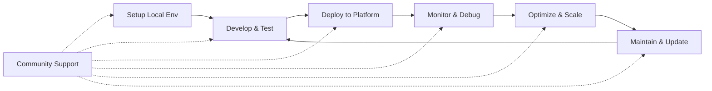

# Developer Resources & Support

Essential tools, resources, and support channels for developers working with the Edge Platform.

## Overview

This section provides comprehensive developer resources to help you be productive with the Edge Platform, from setting up local development environments to troubleshooting production issues.

## What You'll Find

### A. Local Development Environment Setup
Complete guidance for setting up local development environments including mini-Kubernetes solutions, edge simulators, and debugging tools.

### B. Command-Line Tools & APIs
Essential CLI tools, kubectl plugins, platform-specific command-line interfaces, and comprehensive API reference documentation.

### C. Troubleshooting & FAQs
Common issues and solutions, error code references, and step-by-step debugging guides for typical problems.

### D. Support & Community
Support channels, community resources, release notes, and platform roadmap information.

## Developer Workflow

## Quick Start Checklist

Before you begin development:

### Environment Setup
- [ ] Set up your local development environment.
- [ ] Install essential CLI tools.
- [ ] Configure access credentials.

### Knowledge Base
- [ ] Familiarize yourself with troubleshooting resources.
- [ ] Join the community channels.
- [ ] Review platform documentation.

## Development Best Practices

### Environment Management

#### Consistency
Use consistent development environments across team members

#### Isolation
Implement proper resource isolation

#### Parity
Maintain environment parity with production

### Debugging & Troubleshooting

#### Logging Strategy
Implement comprehensive logging strategies

#### Distributed Tracing
Use distributed tracing for complex applications

#### Runbooks
Maintain runbooks for common issues

### Community Engagement

#### Participation
Participate in community discussions

#### Knowledge Sharing
Share knowledge and best practices

#### Contribution
Contribute to platform improvement

## Getting Started

Start with Local Development Environment Setup to configure your development environment. Then, explore the CLI tools and troubleshooting resources as needed. Each section provides practical guidance with examples and step-by-step instructions to support your development journey.

Each section provides practical guidance with examples and step-by-step instructions. 