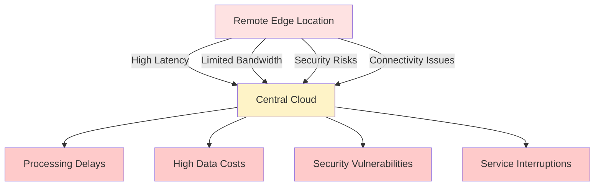
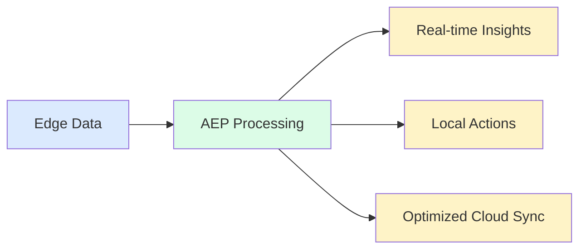
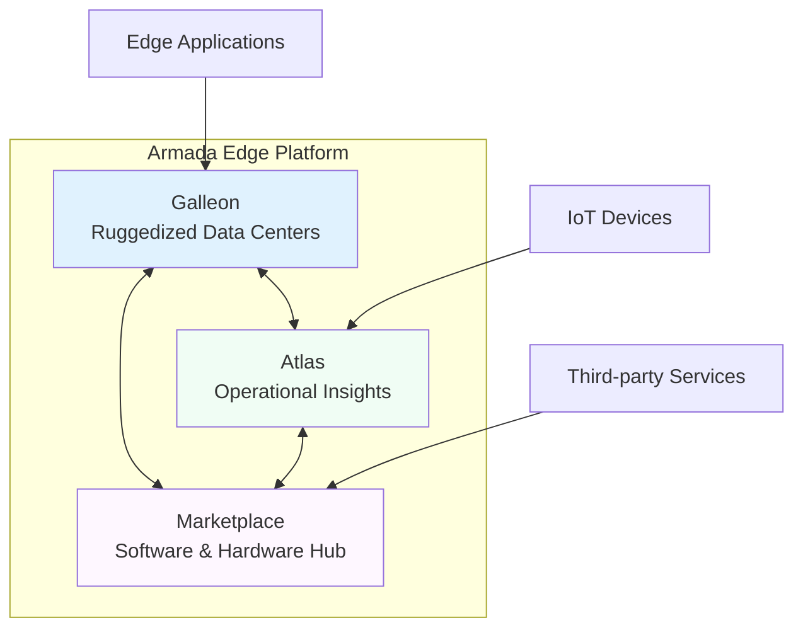
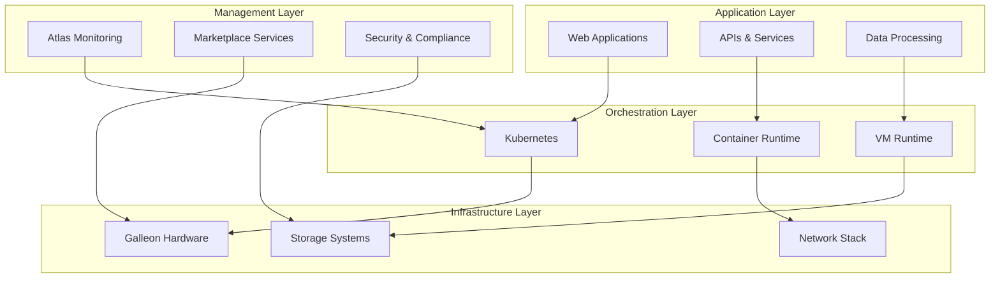

import FeedbackWidget from '@site/src/components/FeedbackWidget';

# Edge Platform Overview

Welcome to the documentation for the **Armada Edge Platform (AEP)**! 

:::info What you'll learn
This section provides a high-level overview of AEP, its purpose, and how it empowers Independent Software Vendors (ISVs) like you to deploy and manage your applications at the remote edge.
:::

## What is the Armada Edge Platform?

The Armada Edge Platform is a **powerful, modular infrastructure** designed to solve the most challenging problems of deploying and operating applications in remote, disconnected, or resource-constrained environments.

### Key Value Proposition

AEP brings the capabilities of cloud computing directly to where your data is generated, ensuring:
- **Seamless performance** where it matters most
- **Scalable infrastructure** that grows with your needs
- **Resilient operations** in challenging environments

The platform is built on a foundation of robust, secure, and highly resilient components, enabling you to extend your application's reach beyond traditional data centers and central clouds.

## Why the Edge? Why Armada?

Traditional cloud infrastructure, while powerful, often faces significant limitations when dealing with data generated at the extreme edge.

### Challenges of Traditional Cloud Infrastructure

#### 🚨 High Latency
Sending data back to a central cloud for processing introduces delays that are **unacceptable for real-time applications**.

*Examples:*
- Industrial automation systems
- Autonomous vehicles
- Real-time analytics platforms

#### 📡 Limited Bandwidth
Remote locations often have intermittent or low-bandwidth connectivity, making it **impractical to constantly stream large volumes of data** to the cloud.

#### 🔒 Security Concerns
Data in transit or stored in centralized locations can be vulnerable to:
- Interception during transmission
- Centralized breach points
- Compliance challenges

#### ⚡ Operational Resilience
Many edge environments require applications to **function autonomously** even when disconnected from the central network.

### Armada's Solutions

The Armada Edge Platform addresses these challenges by providing:

#### ⚡ Real-time Processing
Process data directly at the source, enabling **immediate insights and actions** without cloud roundtrips.

#### 📊 Bandwidth Optimization
Reduce data egress costs and improve efficiency by **only sending mission-critical insights** back to the cloud.

#### 🛡️ Enhanced Security
Keep sensitive data localized and leverage **robust security features** designed specifically for distributed environments.

#### 🔄 Unmatched Resilience
Ensure application continuity even in **challenging or disconnected scenarios** with autonomous operation capabilities.

#### 🚀 Simplified Deployment
Deploy complex applications with ease using a **turnkey solution** that handles infrastructure complexity.

## Core Components of the Armada Edge Platform

The Armada Edge Platform comprises three primary components that work together to deliver comprehensive edge capabilities:

### 🏗️ Galleon

**Our ruggedized modular data centers** - the physical backbone of edge computing.

Galleons are engineered to bring powerful processing and storage capabilities directly to your edge locations, featuring:

- **Multiple form factors** designed for diverse environmental challenges
- **Ruggedized design** for harsh conditions
- **Modular architecture** for scalability
- **High-performance computing** in compact packages

:::tip Galleon Use Cases
Perfect for remote mining operations, offshore platforms, military deployments, and industrial sites where traditional infrastructure isn't viable.
:::

### 📊 Atlas

**Our operational insights product** for all your connected assets.

Atlas provides a single pane of glass for seamlessly monitoring and managing your IoT devices and edge infrastructure:

- **Unified monitoring** across all connected assets
- **Real-time insights** and alerting
- **Predictive maintenance** capabilities
- **Comprehensive device management**

:::note Atlas Integration
Atlas integrates seamlessly with existing monitoring tools and provides APIs for custom integrations.
:::

### 🛒 Marketplace

**Your hub for edge computing resources** - everything you need to operate at the remote edge.

The Marketplace is where you can discover, deploy, and manage:

- **Pre-optimized applications** for edge environments
- **Hardware solutions** for specific use cases
- **Third-party integrations** and services
- **Community-contributed resources**

:::important Marketplace Benefits
All marketplace offerings are pre-validated for edge environments, ensuring compatibility and performance optimization.
:::

## Platform Capabilities

By leveraging these components, ISVs can unlock new possibilities for their applications, extending their reach and impact to the farthest corners of the globe.

### 🚀 Cloud-Native Foundation
- Built on **Kubernetes** with enterprise-grade orchestration
- Support for both **containers and virtual machines**
- **GitOps-ready** deployment workflows

### ⚡ Edge Computing Optimization
- **Reduced latency** through local processing
- **Improved performance** with edge-specific optimizations
- **Autonomous operation** during connectivity loss

### 🔄 Application Modernization
- **Migration tools** for legacy applications
- **Microservices frameworks** for scalable architectures
- **DevOps integration** for streamlined development

### 📈 Scalable Infrastructure
- **Auto-scaling** based on demand
- **Load balancing** for optimal resource utilization
- **Resource optimization** for cost efficiency

### 🔍 Operational Excellence
- **Comprehensive monitoring** and logging
- **Distributed tracing** for debugging
- **Performance observability** across the stack

## Platform Architecture

The platform supports multiple deployment patterns to accommodate diverse application requirements:

### 📦 Container-Based Workloads
- **Native Kubernetes deployments** with full orchestration
- **Helm chart packaging** for simplified distribution
- **Microservices architectures** with service mesh integration

### 💻 Virtual Machine Workloads
- **KubeVirt integration** for VM management within Kubernetes
- **Legacy application support** without modification
- **Hybrid container-VM deployments** for complex scenarios

### 🔄 Application Migration Paths
- **Lift-and-shift VM deployments** for immediate edge presence
- **Containerization strategies** for modernization
- **Microservices decomposition** for long-term scalability

## Getting Started

This documentation will guide you through your edge computing journey:

### 1. 📚 Platform Fundamentals
Understanding core concepts and capabilities that power the edge platform.

**Next:** [Key Concepts](./key-concepts) - Essential knowledge for working with AEP

### 2. 🔄 Application Modernization
Strategies for transforming applications to thrive in edge environments.

**Explore:** [Microservice Fundamentals](../application-modernization/microservice-fundamentals)

### 3. 📖 Migration Playbooks
Step-by-step guides for different migration scenarios and use cases.

**Start with:** [Migration Overview](../migration-playbooks/overview)

### 4. 🏗️ Platform Deep Dive
Advanced concepts for power users and platform engineers.

**Dive in:** [Platform Architecture](../platform-deep-dive/overview)

---

:::tip Ready to get started?
Begin with the [Key Concepts](./key-concepts) to understand the foundational elements of the platform, or jump directly to our [Migration Playbooks](../migration-playbooks/overview) if you have an existing application to modernize.
:::

:::info Need help?
- Check our [Community Resources](../developer-resources/support/community-resources)
- Browse the [Glossary](../glossary) for technical definitions
- Visit [Support Channels](../developer-resources/support/support-channels) for direct assistance
:::

<FeedbackWidget /> 